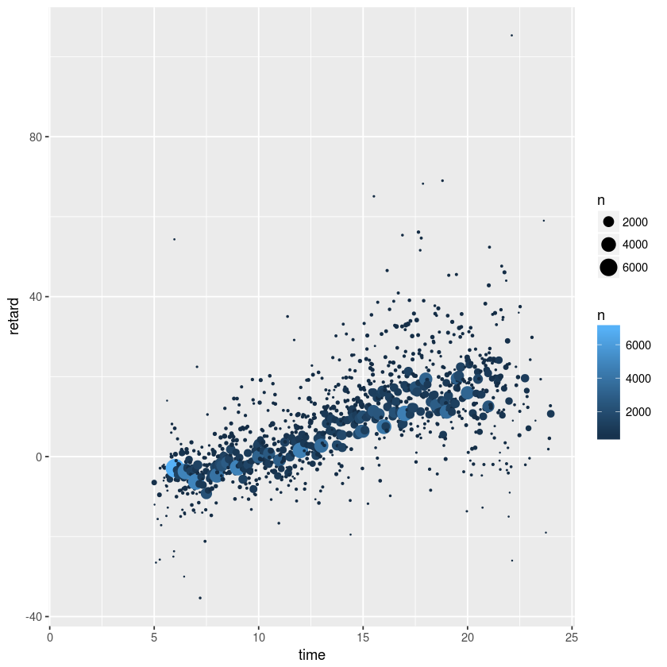
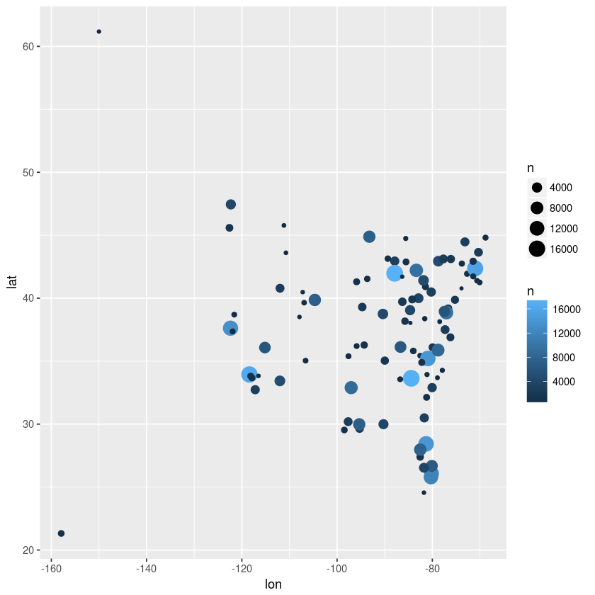
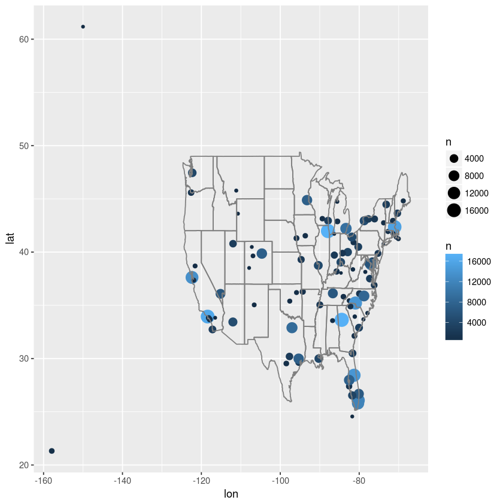
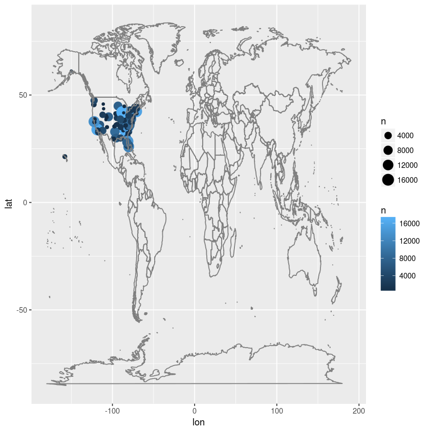

## Benvinguts/des a la pàgina del curs _R, visualització gràfica i Big Data_

Des d'aquí podreu seguir el curs sencer. És un bon lloc per començar a aprendre R!

Aquesta web utilitza [Markdown](https://daringfireball.net/projects/markdown/) i està penjada a [GitHub](https://github.com/jantonz/IntroductionR). Un cop completat el curs podreu proposar canvis a la web i podran ser implementats a la següent edició. En llenguatge GitHub, els vostres _commits_ podran ser _pushed_ a la _branch_ principal... ja hi arribarem!

# 0. Descàrregues
### 0.1. Programari

- **R:** [link](https://www.r-project.org/)
- **RStudio:** [link](https://www.rstudio.com/)

### 0.2. Dades

- **iris:** [link](https://github.com/jantonz/IntroductionR/blob/master/iris.csv?raw=true).
- **mtcars:** [link](https://github.com/jantonz/IntroductionR/blob/master/mtcars.txt?raw=true).

### 0.3. Cheat Sheets

- **R Base:** [link](https://github.com/jantonz/IntroductionR/blob/master/base-r.pdf?raw=true)
- **dplyr:** [link](https://github.com/jantonz/IntroductionR/blob/master/data-wrangling-cheatsheet.pdf?raw=true)
- **ggplot2:** [link](https://github.com/jantonz/IntroductionR/blob/master/ggplot2-cheatsheet.pdf?raw=true)

### 0.4. Exercicis

- **Exercici Vols New York 2013:** [link](https://github.com/jantonz/IntroductionR/blob/master/Exercici%20dplyr.pdf?raw=true)


# 1. Introducció a R
### 1.1. Primers passos en R (fora d'R)

Els primers passos els farem en [aquesta web](http://tryr.codeschool.com/). Es tracta d'una molt bona manera de fer els primers passos en diversos llenguatges de programació, per si després us animeu a aprendre Python, per exemple.

### 1.2. Instal·lació d'R i RStudio

Ara que hem jugat una mica i hem après els conceptes bàsics del llenguatge, els aplicarem dins l'espai de treball adequat. Per fero, primer ens descarregarem:
- [R](https://www.r-project.org/) i
- [RStudio](https://www.rstudio.com/)

La seva instal·lació és molt fàcil, i millor que es faci per ordre. La feina la farem en RStudio.

### 1.3. Primers passos en R (dins d'R)

És bon moment per provar algunes de les **funcions** que hem après. [Aquí](https://github.com/jantonz/IntroductionR/blob/master/base-r.pdf?raw=true) teniu una _chuleta_ (_cheat sheet_ en anglès) amb moltes funcions per provar.

# 2. Lectura i anàlisi dades

### 2.1. Funcions bàsiques

Porvarem de llegir els següents fitxers:

- **iris:** [clica aquí](https://github.com/jantonz/IntroductionR/blob/master/iris.csv?raw=true).
- **mtcars:** [clica aquí](https://github.com/jantonz/IntroductionR/blob/master/mtcars.txt?raw=true).

Utilitzarem les funcions ```read.csv``` i ```read.table```, respectivament.

Ara podem provar d'aplicar sobre les *data.frames* algunes funcions:

```
str()
head()
tail()
summary()
dim()
View()
class()
```

### 2.2. Data _wrangling_

El paquet _dplyr_ és molt útil per manipular dades i es pot descarregar via `install.packages("dplyr")`. Recordeu de cridar-lo (`library(dplyr)`) abans d'utilitzar-lo.

Un _cheat sheet_ d'aquest paquet es troba [aquí](https://github.com/jantonz/IntroductionR/blob/master/data-wrangling-cheatsheet.pdf?raw=true).

Passarem una bona estona treballant els apartats 1, 2a-c i 3a-c d'[aquest exercici](https://github.com/jantonz/IntroductionR/blob/master/Exercici%20dplyr.pdf?raw=true). Es tracta d’un exercici que ens fa treballar amb dades sobre els vols que van volar des dels aeroports JFK, LGA i EWR de Nova York l’any 2013.

# 3. Representació gràfica

Per a visualitzar dades amb R, el paquet més utilitzat és _ggplot2_. El seu _cheat sheet_ es troba [aquí](https://github.com/jantonz/IntroductionR/blob/master/ggplot2-cheatsheet.pdf?raw=true) i l'utilitzarem per acabar l'exercici anterior.

Es poden fer moltes correlacions, però recordeu que correlació no implica causalitat: [Spurious correlations](http://www.tylervigen.com/spurious-correlations). Aquí hi podeu trobar algunes informacions molt interessants, com que el consum de formatge per càpita es correlaciona en un 95% amb el nombre de persones mortes per per ofegament en els llençols. Alerta!

# 4. Següents passos

Check this out:
- [swirl](http://swirlstats.com/scn/)
- [manipulate](https://support.rstudio.com/hc/en-us/articles/200551906-Interactive-Plotting-with-Manipulate)
- [Shiny](https://shiny.rstudio.com/)
- [R Notebook](http://rmarkdown.rstudio.com/r_notebooks.html)
- [DataCamp](https://www.datacamp.com/)
- [Coursera](https://www.coursera.org/specializations/jhu-data-science)

<br><br>


_Josep Anton Mir Tutusaus. 2018 ._

<br><br>
<br><br>

-----------------------------------

#### [Aquí podeu trobar l'exercici solucionat](exercici_dplyr_i_ggplot2)


# Exercici dplyr i ggplot2

## 1. Inici
### a) Instal·la el paquet _nycflights13_
### b) Carrega el paquet _nycflights13_


```R
install.packages("nycflights13")

```

    Updating HTML index of packages in '.Library'
    Making 'packages.html' ... done


```R
library(nycflights13)
```

En el context de l'exercici, també necessitarem els paquets dplyr, ggplot2 i maps:


```R
install.packages(c("dplyr", "ggplot2", "maps"))
```

    Updating HTML index of packages in '.Library'
    Making 'packages.html' ... done


```R
library(dplyr)
library(ggplot2)
library(maps)
```

Carrega la base de dades adequada (la que conté les variables d’interès), assigna-la a _vols_ i investiga-la una mica amb str(), head(), summary().
L'assignem a una variable diferent (_vols_) a l'original perquè així podem modificar-la sense malmetre les dades oringals, allò que en anglès es diu _raw data_.


```R
vols <- flights
```


```R
head(vols, 10)
```


<table>
<tbody>
	<tr><td>2013               </td><td>1                  </td><td>1                  </td><td>517                </td><td>515                </td><td> 2                 </td><td> 830               </td><td> 819               </td><td> 11                </td><td>UA                 </td><td>1545               </td><td>N14228             </td><td>EWR                </td><td>IAH                </td><td>227                </td><td>1400               </td><td>5                  </td><td>15                 </td><td>2013-01-01 05:00:00</td></tr>
	<tr><td>2013               </td><td>1                  </td><td>1                  </td><td>533                </td><td>529                </td><td> 4                 </td><td> 850               </td><td> 830               </td><td> 20                </td><td>UA                 </td><td>1714               </td><td>N24211             </td><td>LGA                </td><td>IAH                </td><td>227                </td><td>1416               </td><td>5                  </td><td>29                 </td><td>2013-01-01 05:00:00</td></tr>
	<tr><td>2013               </td><td>1                  </td><td>1                  </td><td>542                </td><td>540                </td><td> 2                 </td><td> 923               </td><td> 850               </td><td> 33                </td><td>AA                 </td><td>1141               </td><td>N619AA             </td><td>JFK                </td><td>MIA                </td><td>160                </td><td>1089               </td><td>5                  </td><td>40                 </td><td>2013-01-01 05:00:00</td></tr>
	<tr><td>2013               </td><td>1                  </td><td>1                  </td><td>544                </td><td>545                </td><td>-1                 </td><td>1004               </td><td>1022               </td><td>-18                </td><td>B6                 </td><td> 725               </td><td>N804JB             </td><td>JFK                </td><td>BQN                </td><td>183                </td><td>1576               </td><td>5                  </td><td>45                 </td><td>2013-01-01 05:00:00</td></tr>
	<tr><td>2013               </td><td>1                  </td><td>1                  </td><td>554                </td><td>600                </td><td>-6                 </td><td> 812               </td><td> 837               </td><td>-25                </td><td>DL                 </td><td> 461               </td><td>N668DN             </td><td>LGA                </td><td>ATL                </td><td>116                </td><td> 762               </td><td>6                  </td><td> 0                 </td><td>2013-01-01 06:00:00</td></tr>
	<tr><td>2013               </td><td>1                  </td><td>1                  </td><td>554                </td><td>558                </td><td>-4                 </td><td> 740               </td><td> 728               </td><td> 12                </td><td>UA                 </td><td>1696               </td><td>N39463             </td><td>EWR                </td><td>ORD                </td><td>150                </td><td> 719               </td><td>5                  </td><td>58                 </td><td>2013-01-01 05:00:00</td></tr>
	<tr><td>2013               </td><td>1                  </td><td>1                  </td><td>555                </td><td>600                </td><td>-5                 </td><td> 913               </td><td> 854               </td><td> 19                </td><td>B6                 </td><td> 507               </td><td>N516JB             </td><td>EWR                </td><td>FLL                </td><td>158                </td><td>1065               </td><td>6                  </td><td> 0                 </td><td>2013-01-01 06:00:00</td></tr>
	<tr><td>2013               </td><td>1                  </td><td>1                  </td><td>557                </td><td>600                </td><td>-3                 </td><td> 709               </td><td> 723               </td><td>-14                </td><td>EV                 </td><td>5708               </td><td>N829AS             </td><td>LGA                </td><td>IAD                </td><td> 53                </td><td> 229               </td><td>6                  </td><td> 0                 </td><td>2013-01-01 06:00:00</td></tr>
	<tr><td>2013               </td><td>1                  </td><td>1                  </td><td>557                </td><td>600                </td><td>-3                 </td><td> 838               </td><td> 846               </td><td> -8                </td><td>B6                 </td><td>  79               </td><td>N593JB             </td><td>JFK                </td><td>MCO                </td><td>140                </td><td> 944               </td><td>6                  </td><td> 0                 </td><td>2013-01-01 06:00:00</td></tr>
	<tr><td>2013               </td><td>1                  </td><td>1                  </td><td>558                </td><td>600                </td><td>-2                 </td><td> 753               </td><td> 745               </td><td>  8                </td><td>AA                 </td><td> 301               </td><td>N3ALAA             </td><td>LGA                </td><td>ORD                </td><td>138                </td><td> 733               </td><td>6                  </td><td> 0                 </td><td>2013-01-01 06:00:00</td></tr>
</tbody>
</table>


```R
str(vols)
```

    Classes ‘tbl_df’, ‘tbl’ and 'data.frame':	336776 obs. of  19 variables:
     $ year          : int  2013 2013 2013 2013 2013 2013 2013 2013 2013 2013 ...
     $ month         : int  1 1 1 1 1 1 1 1 1 1 ...
     $ day           : int  1 1 1 1 1 1 1 1 1 1 ...
     $ dep_time      : int  517 533 542 544 554 554 555 557 557 558 ...
     $ sched_dep_time: int  515 529 540 545 600 558 600 600 600 600 ...
     $ dep_delay     : num  2 4 2 -1 -6 -4 -5 -3 -3 -2 ...
     $ arr_time      : int  830 850 923 1004 812 740 913 709 838 753 ...
     $ sched_arr_time: int  819 830 850 1022 837 728 854 723 846 745 ...
     $ arr_delay     : num  11 20 33 -18 -25 12 19 -14 -8 8 ...
     $ carrier       : chr  "UA" "UA" "AA" "B6" ...
     $ flight        : int  1545 1714 1141 725 461 1696 507 5708 79 301 ...
     $ tailnum       : chr  "N14228" "N24211" "N619AA" "N804JB" ...
     $ origin        : chr  "EWR" "LGA" "JFK" "JFK" ...
     $ dest          : chr  "IAH" "IAH" "MIA" "BQN" ...
     $ air_time      : num  227 227 160 183 116 150 158 53 140 138 ...
     $ distance      : num  1400 1416 1089 1576 762 ...
     $ hour          : num  5 5 5 5 6 5 6 6 6 6 ...
     $ minute        : num  15 29 40 45 0 58 0 0 0 0 ...
     $ time_hour     : POSIXct, format: "2013-01-01 05:00:00" "2013-01-01 05:00:00" ...


```R
summary(vols)
```


          year          month             day           dep_time    sched_dep_time
     Min.   :2013   Min.   : 1.000   Min.   : 1.00   Min.   :   1   Min.   : 106  
     1st Qu.:2013   1st Qu.: 4.000   1st Qu.: 8.00   1st Qu.: 907   1st Qu.: 906  
     Median :2013   Median : 7.000   Median :16.00   Median :1401   Median :1359  
     Mean   :2013   Mean   : 6.549   Mean   :15.71   Mean   :1349   Mean   :1344  
     3rd Qu.:2013   3rd Qu.:10.000   3rd Qu.:23.00   3rd Qu.:1744   3rd Qu.:1729  
     Max.   :2013   Max.   :12.000   Max.   :31.00   Max.   :2400   Max.   :2359  
                                                     NA's   :8255                 
       dep_delay          arr_time    sched_arr_time   arr_delay       
     Min.   : -43.00   Min.   :   1   Min.   :   1   Min.   : -86.000  
     1st Qu.:  -5.00   1st Qu.:1104   1st Qu.:1124   1st Qu.: -17.000  
     Median :  -2.00   Median :1535   Median :1556   Median :  -5.000  
     Mean   :  12.64   Mean   :1502   Mean   :1536   Mean   :   6.895  
     3rd Qu.:  11.00   3rd Qu.:1940   3rd Qu.:1945   3rd Qu.:  14.000  
     Max.   :1301.00   Max.   :2400   Max.   :2359   Max.   :1272.000  
     NA's   :8255      NA's   :8713                  NA's   :9430      
       carrier              flight       tailnum             origin         
     Length:336776      Min.   :   1   Length:336776      Length:336776     
     Class :character   1st Qu.: 553   Class :character   Class :character  
     Mode  :character   Median :1496   Mode  :character   Mode  :character  
                        Mean   :1972                                        
                        3rd Qu.:3465                                        
                        Max.   :8500                                        

         dest              air_time        distance         hour      
     Length:336776      Min.   : 20.0   Min.   :  17   Min.   : 1.00  
     Class :character   1st Qu.: 82.0   1st Qu.: 502   1st Qu.: 9.00  
     Mode  :character   Median :129.0   Median : 872   Median :13.00  
                        Mean   :150.7   Mean   :1040   Mean   :13.18  
                        3rd Qu.:192.0   3rd Qu.:1389   3rd Qu.:17.00  
                        Max.   :695.0   Max.   :4983   Max.   :23.00  
                        NA's   :9430                                  
         minute        time_hour                  
     Min.   : 0.00   Min.   :2013-01-01 05:00:00  
     1st Qu.: 8.00   1st Qu.:2013-04-04 13:00:00  
     Median :29.00   Median :2013-07-03 10:00:00  
     Mean   :26.23   Mean   :2013-07-03 05:02:36  
     3rd Qu.:44.00   3rd Qu.:2013-10-01 07:00:00  
     Max.   :59.00   Max.   :2013-12-31 23:00:00  


## 2. Retard vs. Temps
### a) Crea una nova variable _time_ dins la base de dades _vols_, que contingui l’hora i minut com un sol valor decimal (de l’estil 1.01, 1.10, 1.50 hores).


```R
vols$time <- vols$hour + vols$minute / 60
```

Comprovem que la nostra nova columna s'ha afegit al final (a la dreta) de la nostra _dataframe_:


```R
head(vols, 5)
```


<table>
<tbody>

	<tr><td>year               </td><td>month              </td><td>day                  </td><td>dep_time          </td><td>sched_dep_time     </td><td> dep_delay                 </td><td> arr_time         </td><td> sched_arr_time    </td><td> arr_delay                </td><td>carrier           </td><td>flight             </td><td>tailnum             </td><td>origin            </td><td>dest               </td><td>air_time                </td><td>distance          </td><td>hour               </td><td>minute                 </td><td>time_hour         </td><td>time               </td></tr>
	<tr><td>2013               </td><td>1                  </td><td>1                  </td><td>517                </td><td>515                </td><td> 2                 </td><td> 830               </td><td> 819               </td><td> 11                </td><td>UA                 </td><td>1545               </td><td>N14228             </td><td>EWR                </td><td>IAH                </td><td>227                </td><td>1400               </td><td>5                  </td><td>15                 </td><td>2013-01-01 05:00:00</td><td>5.250000           </td></tr>
	<tr><td>2013               </td><td>1                  </td><td>1                  </td><td>533                </td><td>529                </td><td> 4                 </td><td> 850               </td><td> 830               </td><td> 20                </td><td>UA                 </td><td>1714               </td><td>N24211             </td><td>LGA                </td><td>IAH                </td><td>227                </td><td>1416               </td><td>5                  </td><td>29                 </td><td>2013-01-01 05:00:00</td><td>5.483333           </td></tr>
	<tr><td>2013               </td><td>1                  </td><td>1                  </td><td>542                </td><td>540                </td><td> 2                 </td><td> 923               </td><td> 850               </td><td> 33                </td><td>AA                 </td><td>1141               </td><td>N619AA             </td><td>JFK                </td><td>MIA                </td><td>160                </td><td>1089               </td><td>5                  </td><td>40                 </td><td>2013-01-01 05:00:00</td><td>5.666667           </td></tr>
	<tr><td>2013               </td><td>1                  </td><td>1                  </td><td>544                </td><td>545                </td><td>-1                 </td><td>1004               </td><td>1022               </td><td>-18                </td><td>B6                 </td><td> 725               </td><td>N804JB             </td><td>JFK                </td><td>BQN                </td><td>183                </td><td>1576               </td><td>5                  </td><td>45                 </td><td>2013-01-01 05:00:00</td><td>5.750000           </td></tr>
	<tr><td>2013               </td><td>1                  </td><td>1                  </td><td>554                </td><td>600                </td><td>-6                 </td><td> 812               </td><td> 837               </td><td>-25                </td><td>DL                 </td><td> 461               </td><td>N668DN             </td><td>LGA                </td><td>ATL                </td><td>116                </td><td> 762               </td><td>6                  </td><td> 0                 </td><td>2013-01-01 06:00:00</td><td>6.000000           </td></tr>
</tbody>
</table>


### b) Calcula el retard mitjà i el nombre de vols per hora per a cada valor de _time_ diferent. El resultat hauria de ser una dataframe anomenada _retard.per.hora_ de 3 columnes, _time_, _retard_ i _n_, amb tantes files com valors de _time_ diferents existeixin. Utilitzar el paquet _**dplyr**_ facilita les coses!


```R
retard.per.hora <- summarise(group_by(vols, time),
                            retard = mean(arr_delay, na.rm=TRUE), n=n())
```

Fixeu-vos en com hem afegit l'argument _na.rm=TRUE_ a la funció _mean_, que serveix per ignorar els valors _NA_.

### c) Visualitza el resultat.


```R
head(retard.per.hora, 20)
```


<table>
<tbody>
  <tr><td>time      </td><td>    retard</td><td>  n       </td></tr>
	<tr><td>1.100000  </td><td>       NaN</td><td>  1       </td></tr>
	<tr><td>5.000000  </td><td> -6.476471</td><td>341       </td></tr>
	<tr><td>5.016667  </td><td>-12.000000</td><td>  1       </td></tr>
	<tr><td>5.083333  </td><td>-26.500000</td><td>  2       </td></tr>
	<tr><td>5.166667  </td><td>-15.600000</td><td>  5       </td></tr>
	<tr><td>5.250000  </td><td> -9.551220</td><td>208       </td></tr>
	<tr><td>5.266667  </td><td>-25.750000</td><td>  4       </td></tr>
	<tr><td>5.283333  </td><td> -2.888889</td><td> 28       </td></tr>
	<tr><td>5.333333  </td><td>-17.142857</td><td>  7       </td></tr>
	<tr><td>5.416667  </td><td> -2.432432</td><td> 37       </td></tr>
	<tr><td>5.450000  </td><td> -6.000000</td><td>  1       </td></tr>
	<tr><td>5.466667  </td><td> -2.000000</td><td>  1       </td></tr>
	<tr><td>5.483333  </td><td> -5.285714</td><td>  7       </td></tr>
	<tr><td>5.500000  </td><td> -2.779412</td><td>137       </td></tr>
	<tr><td>5.566667  </td><td> -7.200000</td><td>  5       </td></tr>
	<tr><td>5.583333  </td><td>-14.833333</td><td>  6       </td></tr>
	<tr><td>5.600000  </td><td> -7.413793</td><td> 29       </td></tr>
	<tr><td>5.616667  </td><td> 14.000000</td><td>  1       </td></tr>
	<tr><td>5.633333  </td><td> -8.500000</td><td>  4       </td></tr>
	<tr><td>5.650000  </td><td>-12.750000</td><td>  4       </td></tr>
</tbody>
</table>


### d) Grafica el retard mitjà versus el temps. Escala la mida dels punts segons el nombre de vols. Quines conclusions se’n poden treure?


```R
ggplot(data = retard.per.hora, aes(time, retard, size = n, color = n)) +
  geom_point() + scale_size_area()
```

    Warning message:
    “Removed 1 rows containing missing values (geom_point).”





Sembla que es pot intuir una relació positiva entre el retard i l'hora de sortida del vol: com més tard surt el vol, amb més retard sembla portar.

## 3. Retard vs. Destí

### a) De manera similar a com s’ha construit la dataframe “retard.per.hora” construirem una dataframe anomenada _retard.per.dest_. El resultat serà una dataframe amb 3 columnes, _dest_, _retard_ i _n_ que contenen, respectivament, el nom de la destinació del vol, el retard del vol i el nombre de vols que han volat a cada destinació. La dataframe tindrà tantes files com destinacions diferents hi hagi.

La pista és que ho fem _de manera similar_. Podem copiar i enganxar el codi anterir i modificar-lo perquè s'adapti al nou problema.


```R
retard.per.dest <- summarise(group_by(vols, dest),
                            retard = mean(arr_delay, na.rm = TRUE), n = n())
```

### b) Visualitza _retard.per.dest_.

Fixeu-vos en com hem afegit l'argument _na.rm=TRUE_ a la funció _mean_, que serveix per ignorar els valors _NA_.


```R
head(retard.per.dest, 20)
```


<table>
<tbody>
	<tr><td>dest     </td><td> retard  </td><td>  n      </td></tr>
	<tr><td>ABQ      </td><td> 4.381890</td><td>  254    </td></tr>
	<tr><td>ACK      </td><td> 4.852273</td><td>  265    </td></tr>
	<tr><td>ALB      </td><td>14.397129</td><td>  439    </td></tr>
	<tr><td>ANC      </td><td>-2.500000</td><td>    8    </td></tr>
	<tr><td>ATL      </td><td>11.300113</td><td>17215    </td></tr>
	<tr><td>AUS      </td><td> 6.019909</td><td> 2439    </td></tr>
	<tr><td>AVL      </td><td> 8.003831</td><td>  275    </td></tr>
	<tr><td>BDL      </td><td> 7.048544</td><td>  443    </td></tr>
	<tr><td>BGR      </td><td> 8.027933</td><td>  375    </td></tr>
	<tr><td>BHM      </td><td>16.877323</td><td>  297    </td></tr>
	<tr><td>BNA      </td><td>11.812459</td><td> 6333    </td></tr>
	<tr><td>BOS      </td><td> 2.914392</td><td>15508    </td></tr>
	<tr><td>BQN      </td><td> 8.245495</td><td>  896    </td></tr>
	<tr><td>BTV      </td><td> 8.950996</td><td> 2589    </td></tr>
	<tr><td>BUF      </td><td> 8.945952</td><td> 4681    </td></tr>
	<tr><td>BUR      </td><td> 8.175676</td><td>  371    </td></tr>
	<tr><td>BWI      </td><td>10.726734</td><td> 1781    </td></tr>
	<tr><td>BZN      </td><td> 7.600000</td><td>   36    </td></tr>
	<tr><td>CAE      </td><td>41.764151</td><td>  116    </td></tr>
	<tr><td>CAK      </td><td>19.698337</td><td>  864    </td></tr>
</tbody>
</table>


### c) Uneix-li la informació d’aeroports (noms i llocs en forma de latitud i longitud). Es pot fer mitjançant la comanda _left_join_ del paquet _dplyr_ o bé amb la comanda _merge_ de R base.  Cal tenir en compte que en una dataframe els noms dels aeroports de destinació estan a la variable _dest_ i en l'altra a la variable _faa_.

Podem utilitzar la següent construcció (en _dplyr_):

retard.per.dest <- left\_join(x = retard.per.dest, y = ...,
                             by = c("dest" = "faa"))

Com a l'inici, convé primer guardar la informació d'aeroports, que es troba a _airports_ en una variable nostra, que anomenarem _aeroports_.


```R
aeroports <- airports
```


```R
retard.per.dest <- left_join(x = retard.per.dest, y = aeroports,
                                   by = c("dest" = "faa"))
```

En base R seria:


```R
retard.per.dest <- merge(x = retard.per.dest, y = aeroports,
                          by.x = "dest", by.y = "faa",
                          all.x = TRUE, all.y = FALSE)
```

Tots els dos codis anteriors fan el mateix.

### d) Grafica latitud versus longitud i escala la mida dels punts segons el nombre de vols.

Recorda l'estructura bàsica d'una crida a ggplot:

ggplot(data = ..., aes(..., ..., size = ...)) + geom\_point()


```R
ggplot(data = retard.per.dest, aes(lon, lat, size = n, color = n)) + geom_point()
```

    Warning message:
    “Removed 4 rows containing missing values (geom_point).”





També podem afegir _color = n_ per pintar els punts amb tonalitats de blau segons tinguin una _n_ major o menor.

### e) Afegeix un mapa dels Estats Units sobre el gràfic. Instal·la i carrega el paquet _maps_. Afegeix "+ borders() + geom\_point()" a la crida del gràfic per mostrar el mapa del món i "+ borders(database = "state", size = 0.5) + geom\_point()" per mostrar només el mapa dels Estats Units.


```R
ggplot(data = retard.per.dest, aes(lon, lat, size = n, color = n)) +
geom_point() + borders(database = "state", size = 0.5)
```

    Warning message:
    “Removed 4 rows containing missing values (geom_point).”





```R
ggplot(data = retard.per.dest, aes(lon, lat, size = n, color = n)) +
geom_point() + borders()
```

    Warning message:
    “Removed 4 rows containing missing values (geom_point).”



